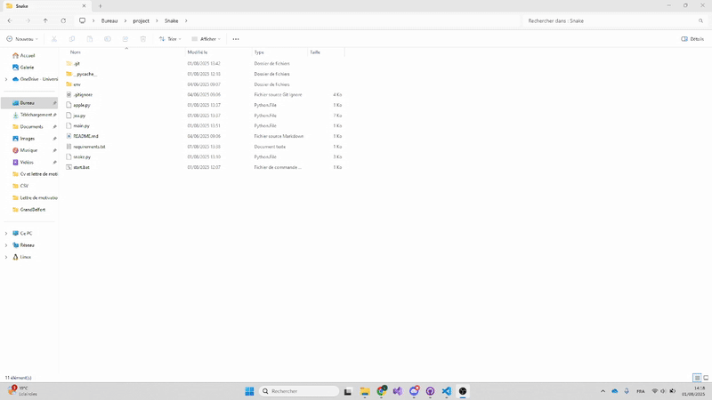

# 🐍 Snake Game – Python & Pygame

Ce projet est une réimplémentation du célèbre jeu **Snake**, codée en **Python** avec la bibliothèque **Pygame**.  
Il a été développé dans le cadre du parcours pédagogique proposé par la plateforme officielle [CodeFI – DANE de Versailles](https://codefi.dane.ac-versailles.fr/) :

📚 [Lien vers le parcours suivi](https://codefi.dane.ac-versailles.fr/spip.php?page=parcours&code=36c152021)

## ▶️ Installation du projet

### ✅ Prérequis

- Python 3.7 ou supérieur installé
- `venv` (inclus avec Python)

### 🛠️ Installation et lancement

1. **Cloner le projet** (ou télécharger le ZIP).

2. **Ouvrer le fichier start.bat** Ce fichier s'occupe de créer un environnement virtuel python, installer les dépendances et lancer le jeu.

## 🎮 Aperçu du jeu

Voici un aperçu du jeu Snake réalisé en Python avec Pygame :

